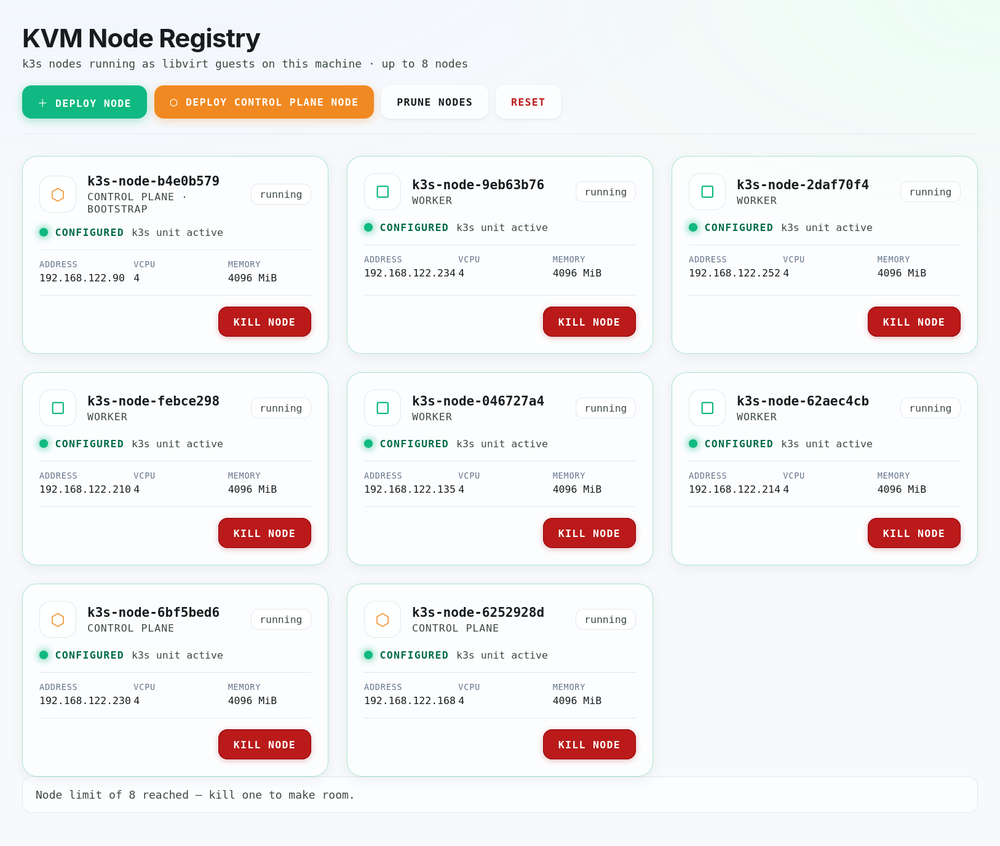

# k3s KVM demo

A kiosk dashboard for a project booth. Each k3s node is a libvirt guest.
Visitors deploy nodes, kill them, and watch the cluster recover.



## Requirements

- An x86_64 MicroOS host with KVM, system libvirt, and rootful Podman with Quadlet.
- An active libvirt network with DHCP. The examples use `qemu:///system` and `default`.
- Active `virtqemud.socket`, `virtstoraged.socket`, and `virtnetworkd.socket` units.
- Host `kubectl` for the demonstrations.

The dashboard has no authentication and controls host VMs through libvirt.
It accepts loopback connections only; use a local kiosk browser for the demo and don't expose it over the network!
The guest image has fixed demo credentials and SSH enabled. Use an isolated demo environment.

## Deploying

The application is primarily deployed from a container image to reduce required tools on the host.
The published container bundles the guest image.

Run the following commands from this repository's root on the booth host.

Copy the configuration, then change `cluster.token` and adjust VM resources for the host:

```bash
cp config.example.toml config.toml
chmod 0600 config.toml
"${EDITOR:-emacs}" config.toml
sudo ./scripts/deploy.sh
```

The script extracts the image if absent, installs configuration, initializes the pool, checks it, and starts the service.
It uses `Image=` from `contrib/k3s-demo.container` and these fixed paths:

- Golden image: `/var/lib/libvirt/images/k3s-base-v2.qcow2`
- Pool directory: `/var/lib/libvirt/images/k3s-demo`
- Kubeconfig: `/run/k3s-kvm-demo/kubeconfig.yaml`

Keep the example paths, pool name, and server settings when using the script.
For custom paths, use [manual installation](docs/operations.md#manual-installation).
For an existing deployment, follow [updating](docs/operations.md#updating) instead.

Open **http://127.0.0.1:8000/**. Check service status and logs with:

```bash
sudo systemctl status k3s-demo.service
sudo journalctl -u k3s-demo.service -n 50
```

## Running a demo

The dashboard starts retained, stopped nodes once on each launch, including after a host reboot.
It starts control-plane VMs before workers and preserves their disks and configuration.
Set `vm.autostart_on_launch = false` to keep stopped nodes stopped across dashboard launches.
See [launch recovery](docs/operations.md#launch-recovery) for eligible states and failure handling.

| Button | Action |
| --- | --- |
| **Deploy Control Plane node** | Bootstrap the cluster or join another embedded-etcd server. |
| **Deploy Node** | Add a worker through a running, configured server with fresh guest status. |
| **Kill node** | Destroy the VM and delete its seed disk and overlay. |
| **Prune Nodes** | Remove Kubernetes Node objects for deleted VMs; retain etcd membership. |
| **Reset** | Delete this deployment's VMs and node volumes. |

`configured` means k3s started successfully at least once. Current service status appears separately.
Use `kubectl` to check Kubernetes `Ready`.

The dashboard maintains an administrator kubeconfig while running. Do not publish it.
Run the demo commands in a root shell to read the exported file:

```bash
sudo -s
export KUBECONFIG=/run/k3s-kvm-demo/kubeconfig.yaml
```

### Demonstrating worker failure

1. Start with an empty cluster. Deploy one control plane node and wait for it to become `configured` with an active service.
2. Deploy two workers. Once `kubectl get nodes` lists all three nodes, wait for readiness:

   ```bash
   kubectl get nodes
   kubectl wait --for=condition=Ready nodes --all --timeout=600s
   ```

3. Replace `WORKER_1` and `WORKER_2` below with the two worker names. Label both so either can run the example workload:

   ```bash
   kubectl label node WORKER_1 WORKER_2 k3s-demo-workload=true
   kubectl apply -f examples/workload.yaml
   kubectl rollout status deployment/worker-demo --timeout=300s
   kubectl get pods -l app=worker-demo -o wide --watch
   ```

4. Click **Kill node** on the worker hosting the pod. Watch a replacement become `Running` on the remaining worker.
5. Press Ctrl+C to stop watching. Use **Prune Nodes** to remove the deleted worker's Kubernetes object, or **Reset** to finish.

Leave capacity on the second worker. The example waits 20 s after node failure detection before eviction; replacement is not immediate.

### Demonstrating quorum loss

1. Click **Reset**. Deploy three control plane nodes, waiting for each to become configured before adding the next.
2. Once `kubectl get nodes` lists all three nodes, wait for `Ready` using the command above.
3. Check the current API address and readiness:

   ```bash
   kubectl config view --minify -o jsonpath='{.clusters[0].cluster.server}{"\n"}'
   kubectl --request-timeout=10s get --raw='/readyz?verbose'
   ```

4. Kill a server other than that API address. Repeat the checks: the cluster should remain ready.
5. Kill another server, keeping the current API server alive. Repeat the readiness check: etcd should fail after quorum is lost.
6. Click **Reset** before starting another demonstration.

The exported kubeconfig targets one VM. If that VM dies, allow the export to refresh before interpreting connection errors as quorum loss.
Killed servers leave etcd members behind. **Prune Nodes** does not remove them, and the quorum banner cannot count them.
Use **Reset** to recover from quorum loss. See [troubleshooting](docs/operations.md#troubleshooting) for other failures.

## Before the event

- Rehearse both demonstrations on the booth host with the intended image.
- Confirm Reset removes the demo VMs and their node volumes.
- Check that a host reboot restores the dashboard, retained VMs, and cluster readiness.
- If operating offline, disconnect external networking and repeat node deployment and the workload demo.

## Further documentation

- [Operations](docs/operations.md): manual installation, service management, updates, kubeconfig, and troubleshooting.
- [Building images](image/Readme.md): guest and container builds, publication, and custom guest requirements.
- [Development](docs/development.md): native setup, architecture, tests, and release checks.
- [VM integration test](tests/integration/Readme.md): opt-in testing on a disposable KVM host.
